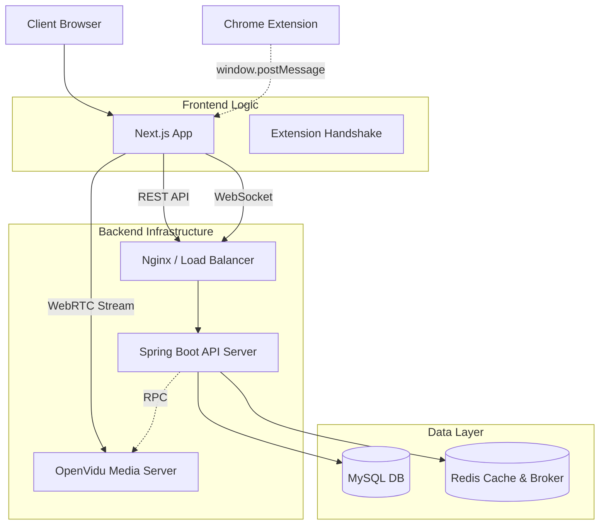

# 아키텍처 설계 문서 (Architecture Design Document)

## 1. 개요 및 설계 원칙
본 문서는 `Peekle` 프로젝트의 전체 시스템 아키텍처를 정의합니다.
시스템은 **확장성(Scalability)**, **실시간성(Real-time)**, **유지보수성(Maintainability)**을 핵심 가치로 삼으며, **Frontend(Next.js)**와 **Backend(Spring Boot)**가 물리적으로 분리된 **Client-Server** 구조를 따릅니다.

### 핵심 원칙
1.  **Strict Separation:** UI와 비즈니스 로직은 API를 통해서만 소통합니다.
2.  **Real-time First:** 사용자의 상호작용(채팅, 코드 편집, 게임 점수)은 WebSocket을 통해 즉시 동기화됩니다.
3.  **State Management:** 서버 상태(Server State)는 `TanStack Query`로, 클라이언트 상태(UI/Session)는 `Zustand`로 관리합니다.

---

## 2. 기술 스택 (Tech Stack)

### 2.1 Frontend (`apps/frontend`)
*   **Framework:** Next.js 15 (App Router)
*   **Language:** TypeScript 5.x
*   **Package Manager:** pnpm 10.28.1
*   **Styling:** Tailwind CSS + Shadcn/UI
*   **State Management:**
    *   **Server State:** TanStack Query (React Query) v5
    *   **Client State:** Zustand
*   **Real-time:**
    *   **WebSocket:** `@stomp/stompjs` + `sockjs-client`
    *   **Media/WebRTC:** `openvidu-browser`
    *   **Editor:** `@monaco-editor/react` (IDE)
    *   **Charts:** `recharts`

### 2.2 Backend (`apps/backend`)
*   **Framework:** Spring Boot 3.4.x
*   **Language:** Java 21
*   **Persistence:** Spring Data JPA (Hibernate), QueryDSL (복잡한 조회)
*   **Database:**
    *   **RDBMS:** MySQL 8.0 (핵심 데이터)
    *   **In-Memory:** Redis 7.x (캐싱, 세션 저장소, Pub/Sub 브로커)
*   **Security:** Spring Security + OAuth2 Client + JWT
*   **Media Server:** OpenVidu Server 2.29.0 + Coturn
*   **Build Tool:** Gradle 8.x

### 2.3 DevOps & Infrastructure
*   **Version Control:** GitLab (SSAFY 제공)
*   **CI/CD:** Jenkins + GitLab Webhook -> Docker Build -> Deploy
*   **Notification:** MatterMost (빌드 알림)
*   **Container:** Docker Compose (Local Dev & Prod)
*   **Monitoring:** Spring Actuator

---

## 3. 시스템 아키텍처 (System Architecture)

### 3.1 전체 구조도


### 3.2 데이터 아키텍처 (Data Flow)
1.  **영속성 데이터 (MySQL):**
    *   사용자 정보, 리그 기록, 문제 데이터, 종료된 게임 결과.
    *   **트랜잭션 보장**이 필요한 모든 데이터.
2.  **휘발성/실시간 데이터 (Redis):**
    *   **Session:** Refresh Token, Online Status.
    *   **Real-time Ranking:** `ZSet`을 활용한 실시간 리그/게임 점수 산정.
    *   **Pub/Sub:** STOMP 메시지 브로커 역할 (채팅, 게임 이벤트 전파).
    *   **Cache:** AI 문제 추천 결과, 빈번한 조회 데이터(User Profile).

---

## 4. 상세 모듈 설계

### 4.1 실시간 통신 전략 (Real-time Strategy)
**OpenVidu (WebRTC) + STOMP (WebSocket)** 하이브리드 구조를 사용합니다.

| 구분 | 프로토콜 | 용도 | 흐름 |
| :--- | :--- | :--- | :--- |
| **미디어** | WebRTC (UDP/TCP) | 화상 채팅, 음성, 화면 공유 | Client <-> OpenVidu Server (Direct P2P or SFU) |
| **시그널링** | WebSocket (STOMP) | 게임 상태, 채팅, 코드 동기화 | Client -> Spring Boot (Broker) -> Clients |

**WebRTC 연결 시퀀스:**
1.  Frontend가 Backend에 `POST /api/sessions` 요청 (세션 생성).
2.  Backend가 OpenVidu Server와 통신하여 `sessionId` 생성 및 반환.
3.  Frontend가 `POST /api/sessions/{id}/connections` 요청 (토큰 발급).
4.  Backend가 OpenVidu Server에서 `token` 발급 후 반환.
5.  Frontend가 `token`을 사용해 미디어 스트림 연결.

### 4.2 협업 에디터 (Collaborative Editor)
*   **알고리즘:** 단순화된 **Last-Write-Wins** 또는 **CRDT-lite** 방식.
*   **구현:**
    *   STOMP Topic: `/topic/study/room/{id}/code`
    *   Payload: `{ type: "CHANGE", delta: "...", cursor: 10 }`
    *   Monaco Editor의 `onChange` 이벤트를 캡처하여 델타를 브로드캐스트.

### 4.3 확장프로그램 연동 (Extension Integration)
보안상의 이유로 웹 페이지는 확장프로그램 API에 직접 접근할 수 없습니다. 따라서 `window.postMessage`를 활용한 핸드셰이크 방식을 사용합니다.

1.  **Handshake:** 웹 페이지 로드 시 `window.postMessage({ type: 'PEEKLE_HELLO' }, '*')` 전송.
2.  **Detection:** 확장프로그램의 Content Script가 이를 수신하고 `{ type: 'PEEKLE_ACK', version: '1.0' }` 응답.
3.  **Auth Sync:** 웹 페이지가 로그인 완료 시 토큰을 생성하여 `{ type: 'PEEKLE_AUTH', token: '...' }` 전송 -> 확장프로그램 스토리지 저장.
4.  **Submission:** 확장프로그램이 백준 사이트에서 정답 감지 시 백엔드 API (`POST /api/submissions`) 직접 호출.

### 4.4 주간 정산 및 티어 승급 전략 (Weekly Settlement & Tier Update)
**Spring Batch**를 활용하여 매주 수요일 새벽 정기 점검 시간(예: 03:00 ~ 04:00)에 일괄 처리합니다. 유저 규모가 커져도 안정적인 처리가 가능하도록 배치 기반으로 설계합니다.

1.  **Maintenance Mode:** 점검 시작 시 서버를 점검 모드로 전환 (사용자 접속 차단).
2.  **Snapshot:** 현재 시점의 리그 랭킹 데이터 스냅샷 생성.
3.  **Calculation:**
    *   각 리그 그룹별 승급/강등 인원 계산.
    *   **Rule Management:** 승급/강등 기준(인원 수, 비율)은 DB가 아닌 **Backend Code (Java Enum)**에서 관리하여 버전 관리 및 변경 용이성 확보.
    *   `USERS` 테이블의 `tier`, `league_group_id` 업데이트 대상 추출.
4.  **Batch Update:**
    *   `USERS` 테이블 일괄 업데이트 (Bulk Update).
    *   `LEAGUE_HISTORY` 테이블에 지난 주 기록 보관 (Insert).
    *   `Redis` 랭킹 정보 초기화 및 재설정.
5.  **Re-open:** 점검 해제 및 서비스 재개.

---

## 5. 프로젝트 구조 (Directory Structure)

```tree
peekle-monorepo/
├── apps/
│   ├── frontend/               # Next.js Application
│   │   ├── src/
│   │   │   ├── app/            # App Router Pages
│   │   │   ├── components/     # UI Components (shared/features)
│   │   │   ├── lib/            # Utilities, API Clients
│   │   │   ├── store/          # Zustand Stores
│   │   │   └── hooks/          # React Hooks (Queries)
│   │   ├── public/
│   │   └── package.json
│   │
│   └── backend/                # Spring Boot Application
│       ├── src/main/java/com/peekle/
│       │   ├── api/            # Controllers (Presentation)
│       │   ├── domain/         # Business Logic & Entities
│       │   ├── infra/          # External Integrations (Redis, OpenVidu)
│       │   └── global/         # Config, Exceptions, Utils
│       └── build.gradle
│
├── docker/                     # Docker Compose Configs
│   ├── mysql/
│   ├── redis/
│   └── openvidu/
└── README.md
```

## 6. API 및 에러 처리 규약

### 응답 래퍼 (Global Response Wrapper)
모든 API 응답은 아래 포맷으로 통일합니다.

```json
{
  "success": true,
  "data": { ... },     // 성공 시 데이터
  "error": null        // 성공 시 null
}
```
```json
{
  "success": false,
  "data": null,
  "error": {
    "code": "USER_NOT_FOUND",
    "message": "사용자를 찾을 수 없습니다."
  }
}
```

---
**이 문서는 개발 진행 상황에 따라 지속적으로 업데이트됩니다.**

