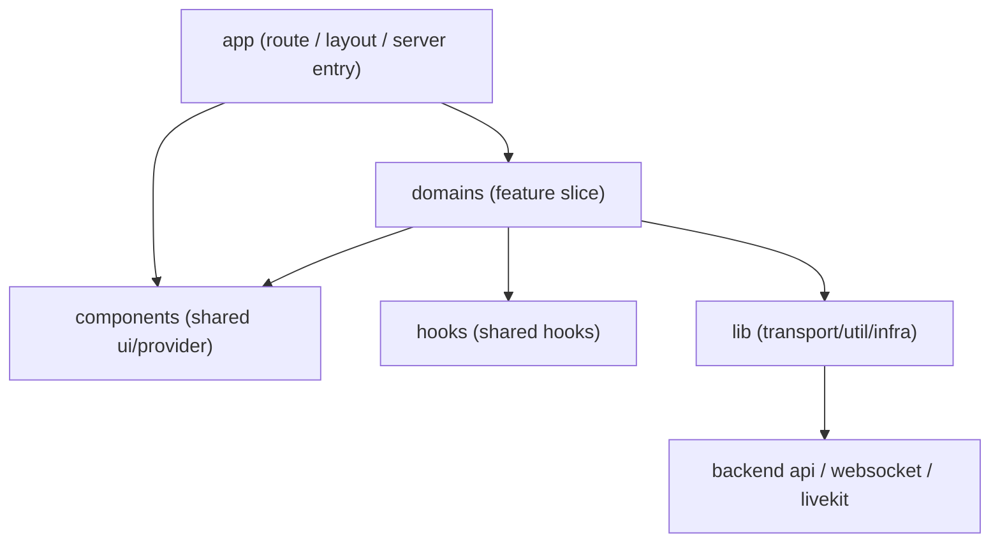
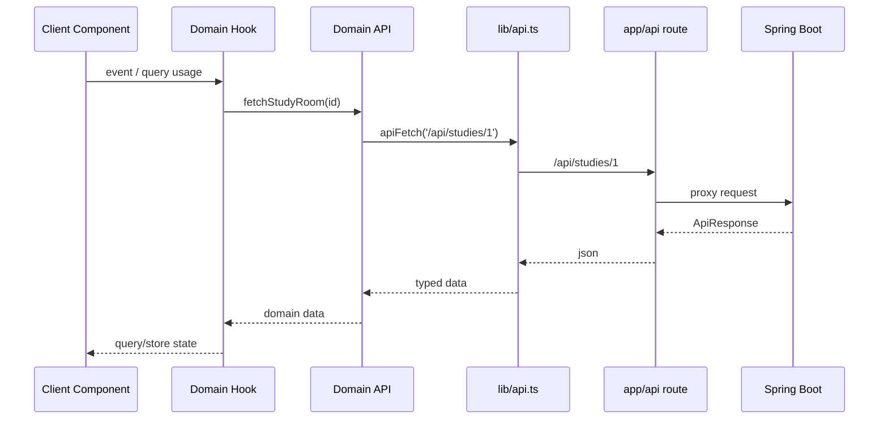

# Frontend Architecture

## 1. Overview

이 문서는 `Peekle` 프런트엔드의 기준 아키텍처를 정의합니다.
기준은 다음 세 가지입니다.

- 현재 저장소 구조와 Next.js 15 App Router 사용 방식
- [.github/instructions/toss-frontend-rule.instructions.md](C:/Users/SSAFY/peekle_github/.github/instructions/toss-frontend-rule.instructions.md)
- [.github/copilot-instructions.md](C:/Users/SSAFY/peekle_github/.github/copilot-instructions.md)

핵심 목표는 아래와 같습니다.

- 읽기 쉬운 구조: UI, 상태, 데이터 접근, 실시간 연결 책임을 분리한다.
- 예측 가능한 구조: 파일명과 폴더 위치만 보고도 역할을 유추할 수 있게 한다.
- 도메인 응집도 강화: 기능별 코드를 `domains` 안에 모으고, 공용화는 충분히 검증된 뒤에만 한다.
- 실시간 협업 대응: `study`, `game` 같은 고복잡도 도메인에서도 UI와 연결 로직이 뒤엉키지 않게 한다.

---

## 2. Design Principles

### 2.1 Readability First

- 복잡한 상호작용은 전용 Hook 또는 Wrapper Component로 분리한다.
- Page/Component는 "무엇을 그리는지"에 집중하고, "어떻게 처리하는지"는 Hook이 담당한다.
- 복잡한 조건 분기는 한 컴포넌트 안에서 삼항연산자로 누적하지 않고 분기 컴포넌트로 나눈다.

### 2.2 Predictable Return Shapes

- 동일 계열 Hook은 동일한 반환 형태를 유지한다.
- 서버 데이터 Hook은 `UseQueryResult<T, Error>` 또는 명시적 Query 객체를 그대로 반환한다.
- 검증/판단 함수는 `ok` 기반의 discriminated union 반환을 기본으로 한다.

### 2.3 Cohesion Over Convenience

- 특정 기능에서만 쓰는 API, Hook, types, context는 해당 도메인 내부에 둔다.
- 두 개 이상 도메인에서 재사용되는 경우에만 `src/components`, `src/hooks`, `src/lib`로 승격한다.
- UI와 비즈니스 상태가 강하게 결합되는 경우, 공용화보다 도메인 응집도를 우선한다.

### 2.4 Strict Separation of Logic and View

- Page 컴포넌트와 일반 UI 컴포넌트 안에서 직접 API 호출, store 조립, 복잡한 상태 계산을 하지 않는다.
- 데이터 취득/조립/이벤트 orchestration은 `useXxxLogic`, `useXxxQuery`, `useXxxStore` 계층으로 보낸다.

### 2.5 Absolute Imports Only

- 상대경로 import는 금지한다.
- 모든 import는 `@/...` 절대경로를 사용한다.

---

## 3. Architecture Summary

프런트엔드는 아래 6개 계층으로 본다.

1. `app`: route, layout, metadata, route handler, server entry
2. `domains`: 기능별 UI, hook, state, api, real-time context
3. `components`: 범도메인 공용 UI와 provider
4. `hooks`: 범도메인 공용 Hook
5. `lib`: 순수 유틸리티, transport, infra helper
6. `types`: 범도메인 공용 타입



규칙은 단순합니다.

- `app`은 도메인을 조합한다.
- `domains`는 기능을 구현한다.
- `components`와 `hooks`는 공용 조각만 가진다.
- `lib`는 프레임워크 비의존 또는 저수준 인프라를 담당한다.

---

## 4. Folder Responsibilities

현재 프런트 루트는 아래 구조를 기준으로 운영합니다.

```text
apps/frontend/src
  app/
  api/
  assets/
  components/
  domains/
  hooks/
  lib/
  store/
  tests/
  types/
```

### 4.1 `app/`

역할:

- route segment
- layout
- page
- metadata
- route handler
- server component entry

규칙:

- `app` 안에는 route와 route composition만 둔다.
- page에서 도메인 로직을 직접 구현하지 않는다.
- 서버에서 필요한 초기 데이터 조합은 route-level server component 또는 server helper에서 수행한다.
- 몰입형 화면과 일반 화면의 layout 정책은 route group으로 분리한다.

예시:

- 일반 화면: `/home`, `/league`, `/ranking`
- 몰입형 화면: `/study/[id]`, `/game/[roomId]`
- 테스트 전용 harness: `/e2e/*`

### 4.2 `domains/`

역할:

- 기능 중심 slice
- 화면별 구성요소
- 기능별 hook
- 기능별 store
- 기능별 API wrapper
- 실시간 context/socket/lifecycle

현재 주요 도메인:

- `study`
- `game`
- `home`
- `league`
- `profile`
- `ranking`
- `settings`
- `workbook`

도메인 내부 권장 구조:

```text
domains/study/
  api/
  components/
  context/
  hooks/
  actions/
  types/
  constants/
  utils/
  tests/
```

규칙:

- 한 도메인 안에서만 쓰는 것은 절대 밖으로 빼지 않는다.
- `study`처럼 실시간/패널/스토어가 큰 도메인은 page-level orchestration hook을 둔다.
- store는 전역 공용보다 기능 scoped store를 우선한다.

### 4.3 `components/`

역할:

- 디자인 시스템 primitive
- cross-domain 공용 provider
- 앱 전역 공통 UX 요소

포함 대상:

- `Button`, `Dialog`, `Tooltip`, `Popover`
- `QueryProvider`, `ResponsiveToaster`, `ClientSessionManager`

포함하면 안 되는 것:

- 특정 도메인 정책이 들어간 카드/패널/모달
- `study` 또는 `game` 전용 interaction

### 4.4 `hooks/`

역할:

- 공용 media query hook
- 공용 debounce hook
- 브라우저 환경 공통 hook

규칙:

- 특정 도메인 상태를 직접 알면 안 된다.
- 도메인 지식이 생기면 즉시 `domains/<feature>/hooks`로 이동한다.

### 4.5 `lib/`

역할:

- API transport
- auth refresh
- query helper
- pure util
- env guard

예시:

- `lib/api.ts`
- `lib/utils.ts`
- `lib/e2e-routes.ts`

규칙:

- `lib`는 가능한 한 UI를 몰라야 한다.
- `lib`는 "어떻게 통신/계산하는가"를 다루고, "어떤 기능인가"는 몰라야 한다.

### 4.6 `store/`

역할:

- 정말 앱 전역으로 필요한 상태만 유지

원칙:

- 앱 전역 인증, 테마처럼 cross-domain 상태만 둔다.
- `study room`, `game room` 같은 기능 상태는 도메인 store로 둔다.

---

## 5. Naming Conventions

### 5.1 Naming Rules

- `camelCase`: 변수, 함수, hook, 유틸 파일
- `PascalCase`: 컴포넌트, 타입, 인터페이스, 컴포넌트 파일
- `SNAKE_CASE`: 상수, env

### 5.2 Component Prefix

- `SC`: server component
- `CC`: client component

예시:

- `SCProfilePage.tsx`
- `CCIDEPanel.tsx`

### 5.3 Route Naming

- `app` 하위 route segment는 kebab-case
- URL은 lowercase

### 5.4 File Naming by Role

- query hook: `useStudyRoomQuery.ts`
- logic hook: `useStudyRoomPageLogic.ts`
- store: `useRoomStore.ts`
- API wrapper: `studyApi.ts`
- route handler: `route.ts`

---

## 6. Rendering Boundary

### 6.1 Server Component Responsibility

서버 컴포넌트는 아래를 담당합니다.

- route-level data prefetch
- metadata
- SEO
- 권한 기반 초기 분기
- client component 조립

서버 컴포넌트는 아래를 직접 하지 않습니다.

- 브라우저 이벤트 처리
- websocket/livekit 연결
- local UI state 관리

### 6.2 Client Component Responsibility

클라이언트 컴포넌트는 아래를 담당합니다.

- user interaction
- animation
- local UI state
- optimistic update
- editor, socket, media, drag/drop

### 6.3 Page Composition Rule

Page는 아래 구조를 기본으로 합니다.

```tsx
export default function StudyPage() {
  return <CCStudyRoomClient />;
}
```

복잡한 조립이 필요하면:

```tsx
export default async function StudyPage({ params }: StudyPageProps) {
  const initialData = await fetchInitialStudyPageData(params.id);

  return <CCStudyRoomClient initialData={initialData} />;
}
```

---

## 7. State Architecture

### 7.1 Server State: TanStack Query

대상:

- 사용자 프로필
- 스터디 상세
- 문제 목록
- 리그/랭킹 데이터
- 제출 결과

규칙:

- query key는 도메인 단위 factory로 관리한다.
- component 내부에서 raw `fetch`보다 domain query hook을 우선한다.
- SSR과 CSR 중복 fetch를 막기 위해 `initialData`, `staleTime`, `enabled` 정책을 명시한다.

권장 예시:

```tsx
export function useStudyRoomQuery(studyId: number): UseQueryResult<StudyRoomDetail, Error> {
  return useQuery({
    queryKey: studyQueryKeys.room(studyId),
    queryFn: () => fetchStudyRoom(studyId),
    staleTime: 60 * 1000,
  });
}
```

### 7.2 Client State: Zustand

대상:

- 패널 열림/닫힘
- 현재 보고 있는 탭
- IDE view mode
- 실시간 대상 사용자
- whiteboard 상태

규칙:

- 기능 단위 store를 우선한다.
- store는 UI 이벤트의 결과 상태만 가진다.
- 서버 원본 데이터 캐시 역할은 하지 않는다.

현재 좋은 예:

- [useRoomStore.ts](C:/Users/SSAFY/peekle_github/apps/frontend/src/domains/study/hooks/useRoomStore.ts)

### 7.3 URL State

대상:

- modal open state
- selected card id
- filter/sort/search

규칙:

- query param별 전용 hook으로 관리한다.
- 한 hook은 한 query state 책임만 가진다.

### 7.4 Form State

원칙:

- 독립 필드 검증: field-level
- 상호 의존 폼 검증: `react-hook-form + zod`

---

## 8. Data Access Architecture

### 8.1 Standard Request Path

브라우저 기준 데이터 흐름:



### 8.2 Transport Layer Rules

- 공통 인증/refresh/에러 표준화는 `lib/api.ts`에서 처리한다.
- 도메인 API는 transport의 thin wrapper를 유지한다.
- component는 transport를 직접 호출하지 않는다.

### 8.3 Route Handler Rules

- `app/api`는 BFF 또는 proxy 계층이다.
- 브라우저에서 직접 백엔드 base URL을 조합하지 않는다.
- 보안/쿠키/리프레시 정책은 route handler와 transport에서 일관되게 처리한다.

---

## 9. Real-Time Architecture

### 9.1 Separation of Realtime Channels

- STOMP/WebSocket: chat, code sync, game events, presence
- LiveKit/WebRTC: audio/video/screen sharing
- Monaco/editor state: client-local editing and rendering model

### 9.2 Realtime Design Rule

실시간 도메인은 아래 4계층으로 나눈다.

1. transport/context: socket 연결, subscription lifecycle
2. sync hook: inbound event 정규화
3. state/store: view 상태 및 대상 선택
4. presentation: panel, banner, list, editor

예시:

```text
domains/study/
  context/SocketContext.tsx
  hooks/useStudySocket.ts
  hooks/useRealtimeCode.ts
  hooks/useRoomStore.ts
  components/CCCenterPanel.tsx
  components/CCIDEPanel.tsx
```

### 9.3 Realtime UI Rule

- packet 수신과 렌더링 비용을 분리한다.
- packet마다 component remount를 유발하지 않는다.
- viewer mode, saved mode, only-mine mode는 별도 code path로 관리한다.

---

## 10. Component Taxonomy

### 10.1 Shared UI Component

조건:

- 두 개 이상 도메인에서 재사용
- 도메인 정책 없음
- 스타일/interaction이 일반화 가능

예시:

- `Button`
- `Dialog`
- `Tooltip`

### 10.2 Domain Component

조건:

- 도메인 개념을 알고 있음
- store나 domain type에 결합됨
- 재사용보다 응집도가 더 중요함

예시:

- `CCIDEPanel`
- `CCStudyRoomClient`
- `CCLeagueMyStatus`

### 10.3 Wrapper Component

조건:

- 인증, 권한, 실시간 연결, confirm flow 등 숨겨야 할 절차가 있음

예시:

- `ClientSessionManager`
- `ThemeProvider`

---

## 11. Recommended Target Structure

아래 구조를 프런트엔드 표준으로 권장합니다.

```text
apps/frontend/src
  app/
    (main)/
    study/[id]/
    game/[roomId]/
    api/
    layout.tsx
    page.tsx
  components/
    common/
    providers/
    ui/
  domains/
    study/
      actions/
      api/
      components/
      context/
      hooks/
      tests/
      types/
      utils/
    game/
    home/
    league/
    profile/
    ranking/
    settings/
    workbook/
  hooks/
  lib/
  store/
  tests/
  types/
```

---

## 12. Testing Architecture

### 12.1 Unit Test

대상:

- pure util
- reducer/store action
- hook branching logic
- component lifecycle regression

위치:

- 도메인 로컬 테스트는 `domains/<feature>/tests`

### 12.2 E2E Test

대상:

- reply/reference flow
- code-share flow
- realtime readonly rendering regression

전략:

- flaky한 전체 room boot 대신 deterministic harness route를 사용한다.
- harness route는 공개 production에서는 비활성화한다.

### 12.3 Test Layer Rule

- unit test는 내부 로직을 검증한다.
- E2E는 사용자 시나리오와 회귀를 검증한다.
- snapshot보다 state assertion을 우선한다.

---

## 13. Architecture Rules for New Code

새 프런트 코드 작성 시 아래를 기본 체크리스트로 사용합니다.

- [ ] 상대경로 import를 쓰지 않았다.
- [ ] 로직과 뷰를 분리했다.
- [ ] 도메인 코드가 shared 영역으로 과도하게 새지 않았다.
- [ ] Query와 Store의 책임을 섞지 않았다.
- [ ] Server Component와 Client Component 경계를 명확히 했다.
- [ ] 복잡한 분기를 전용 컴포넌트 또는 hook으로 분리했다.
- [ ] magic number를 상수화했다.
- [ ] return type을 예측 가능하게 유지했다.

---

## 14. Migration Priorities

현재 코드베이스를 이 아키텍처에 더 가깝게 만들기 위한 우선순위입니다.

### Priority 1

- 상대경로 import 제거
- page-level logic hook 도입
- query key factory 표준화

### Priority 2

- 도메인 API와 transport 계층 일관화
- `store/`와 domain store 경계 재정리
- 중복 fetch 제거와 SSR/CSR 정책 표준화

### Priority 3

- `study`, `game`의 실시간 orchestration hook 세분화
- 공용 form 패턴 정리
- harness 기반 E2E 패턴 문서화

---

## 15. Final Decision

Peekle 프런트엔드는 아래 원칙으로 유지합니다.

- App Router는 route composition과 server entry만 담당한다.
- 기능 구현은 `domains` 중심으로 묶는다.
- 서버 데이터는 TanStack Query, UI 상태는 Zustand로 분리한다.
- 실시간 기능은 socket/media/editor/view state를 계층적으로 나눈다.
- 공용화보다 도메인 응집도를 우선한다.
- `toss-frontend-rule`과 `copilot-instructions`를 구현 규칙으로 채택한다.

